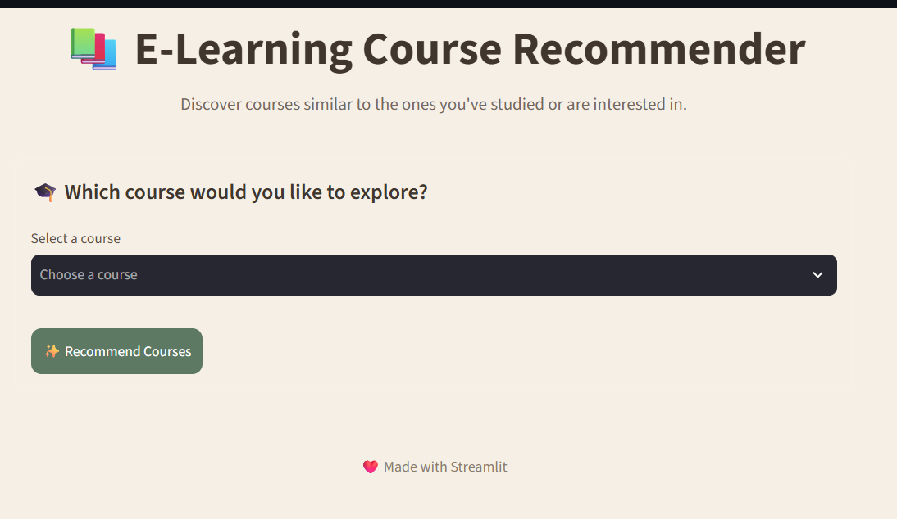
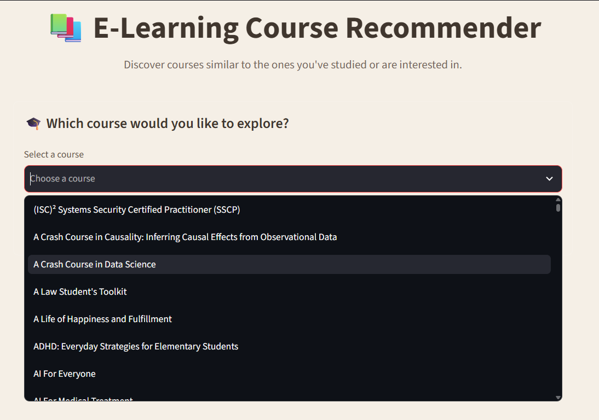
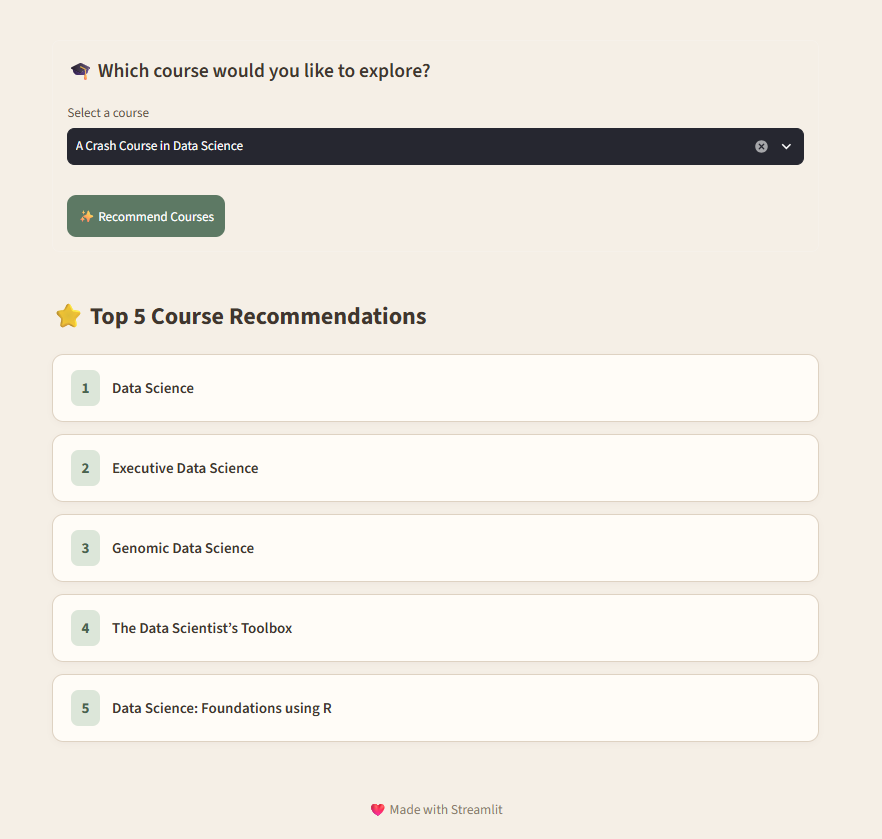
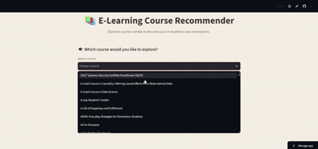

# 📚 E-Learning Course Recommender

A simple **content-based recommendation system** that suggests courses similar to a selected course.

Built using **Python, Scikit-learn, Pandas, and Streamlit**, the application analyzes course information and recommends the **Top 5 most similar courses**.

---

## ✨ Features

* 🎓 Select from a list of available courses
* 🤖 Content-based course recommendation system
* ⭐ Generates the **Top 5 similar courses**
* 📊 Uses **CountVectorizer** for text vectorization
* 📐 Uses **Cosine Similarity** to measure course similarity
* 🎨 Clean and modern Streamlit user interface
* ⚡ Cached model loading for better performance

---

## 🧠 How It Works

The recommendation system follows these steps:

### 1. Load the Dataset

The dataset contains information such as:

* Course Title
* Course Organization
* Course Difficulty

### 2. Create Course Tags

Relevant course information is combined into a single text feature called `tags`.

Example:

```text
Python for Data Science IBM Beginner
```

### 3. Convert Text into Vectors

The project uses Scikit-learn's `CountVectorizer` to convert the course tags into numerical vectors.

### 4. Calculate Similarity

Cosine similarity is calculated between all courses.

```text
Course → Vector Representation → Cosine Similarity → Top 5 Recommendations
```

### 5. Display Recommendations

The Streamlit application displays the five courses with the highest similarity scores.

---

## 🛠️ Tech Stack

| Technology   | Purpose                                         |
| ------------ | ----------------------------------------------- |
| Python       | Core programming language                       |
| Pandas       | Data processing                                 |
| Scikit-learn | Vectorization and similarity calculation        |
| Streamlit    | Web application interface                       |
| Pickle       | Saving the processed data and similarity matrix |

---

## 📂 Project Structure

```text
intelligent-elearning-recommender/
│
├── app.py
├── recommend.py
├── coursea_data.csv
├── courses_data.pkl
├── similarity_matrix.pkl
├── requirements.txt
├── .gitignore
└── README.md
```

### File Description

| File                    | Description                          |
| ----------------------- | ------------------------------------ |
| `app.py`                | Streamlit web application            |
| `recommend.py`          | Builds the recommendation model      |
| `coursea_data.csv`      | Original course dataset              |
| `courses_data.pkl`      | Processed course data                |
| `similarity_matrix.pkl` | Precomputed course similarity matrix |
| `.gitignore`            | Specifies files ignored by Git       |
| `README.md`             | Project documentation                |

---

## ⚙️ Installation

### 1. Clone the repository

```bash
git clone https://github.com/YOUR-USERNAME/YOUR-REPOSITORY.git
```

### 2. Navigate to the project directory

```bash
cd YOUR-REPOSITORY
```

### 3. Install the required dependencies

```bash
pip install pandas scikit-learn streamlit
```

---

## 🚀 Running the Project

### Step 1: Generate the recommendation model

Run:

```bash
python recommend.py
```

This will generate:

```text
courses_data.pkl
similarity_matrix.pkl
```

### Step 2: Start the Streamlit application

```bash
streamlit run app.py
```

The application will open in the browser.

---

## 🖥️ Application Preview

The application allows users to:

1. Select a course.
2. Click **Recommend Courses**.
3. Receive the **Top 5 similar course recommendations**.

Example workflow:

```text
Select Course
      ↓
Click "Recommend Courses"
      ↓
Recommendation Engine
      ↓
Top 5 Similar Courses
```

---

## 🧩 Recommendation Algorithm

The project uses a **content-based filtering approach**.

Each course is represented using:

```text
Course Title + Course Organization + Course Difficulty
```

These features are converted into vectors using:

```text
CountVectorizer
```

The similarity between courses is then calculated using:

```text
Cosine Similarity
```

The courses with the highest similarity scores are returned as recommendations.

---

## 🔮 Future Improvements

Possible improvements include:

* Adding course descriptions and skills as recommendation features
* Using TF-IDF vectorization
* Adding course images and direct course links
* Displaying similarity scores
* Adding search functionality
* Supporting user accounts and personalized recommendations
* Deploying the application online

---
## 📸 Application Screenshots

### 🏠 Home Screen

The landing screen introduces the **E-Learning Course Recommender** and allows users to select a course.



---

### 🎓 Course Selection

Users can browse and select from the available courses using the dropdown menu.



---

### ⭐ Course Recommendations

After selecting a course, the system analyzes course similarity and displays the **Top 5 recommended courses**.



---

## 🎬 Application Demo

A complete demonstration of the application:

<p align="center">  </p>

## 👨‍💻 Author

**Vaishnavi Sahu**

B.Tech Computer Science Engineering Student

---
## 🌐 Website link 

You can try the app by clicking on the given link

https://intelligent-elearning-recommender-8brtiac7h7lwxfgbuqkpvr.streamlit.app/

## 📜 License

This project is created for educational and learning purposes.

---

⭐ If you found this project useful, consider giving the repository a star. Because apparently clicking a tiny star is now the internationally recognized currency of appreciation.
